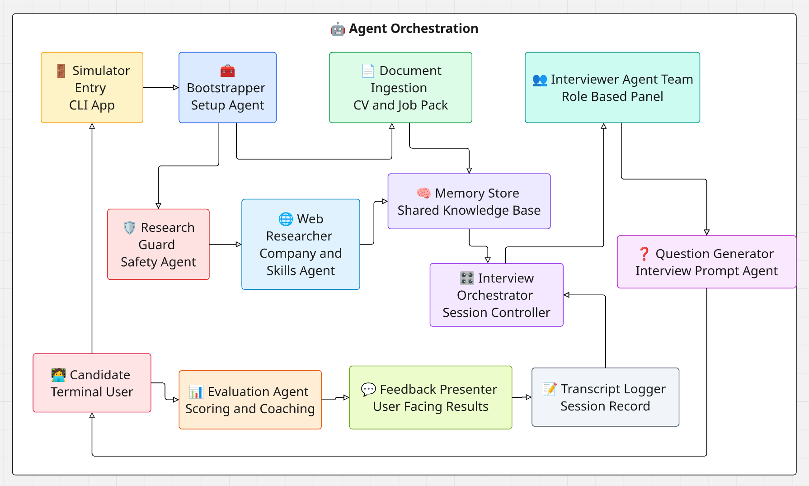

# Agentic AI Interview Simulator

The Agentic AI Interview Simulator is a tool designed to help developers practice for technical interviews. It simulates a realistic interview environment by creating AI agents that act as interviewers. These agents use information from candidate CVs, job descriptions, and real-time web research to ask relevant questions and provide detailed feedback on your answers.



## Features

- **Multi-Interviewer Simulation:** Practice with up to three different interviewers, each with a unique role and style.
- **Context-Aware Questions:** Questions are generated based on your CV and the specific job description provided.
- **Web Research Integration:** The system uses Tavily to research the company and relevant technologies to make the interview more realistic.
- **Detailed Evaluation:** Get immediate feedback, scores, and missing points for each of your answers.
- **Session Transcripts:** Each session is saved as a JSON transcript for later review.

## Prerequisites

You will need the following API keys:
- **OpenAI API Key:** Required for the LLM agents.
- **Tavily API Key:** Required for web research (optional but recommended).

## Installation

The simplest setup is to create a fresh Conda environment and install the Python
packages from `requirements.txt`. The requirements file intentionally uses
minimum supported versions instead of exact pins, so you get compatible current
packages without over-constraining the environment.

1. **Clone the repository** (if you haven't already) and enter the project:
   ```bash
   cd agentic_ai_interview_simulator
   ```

2. **Create and activate a Conda environment:**
   ```bash
   conda create -n interview-sim python=3.10 pip
   conda activate interview-sim
   ```

   Python 3.10 is a conservative default for the current dependency set. Newer
   Python versions may also work if all dependencies install successfully.

3. **Install the project dependencies:**
   ```bash
   python -m pip install -r requirements.txt
   ```

4. **Optional: recreate the setup from your currently active Conda environment.**
   If you already have a working active Conda environment and want to document
   only the packages you explicitly installed through Conda, run:
   ```bash
   conda env export --from-history > environment.yml
   ```

   For this project, keep the application libraries in `requirements.txt` using
   minimum versions such as:
   ```txt
   openai>=1.93.0
   chromadb>=0.5.23
   tavily-python>=0.7.0
   pypdf>=5.0.0
   python-dotenv>=1.0.1
   PyYAML>=6.0.2
   pydantic>=2.8.2
   rich>=13.7.1
   ```

   You can then recreate the Conda environment later with:
   ```bash
   conda env create -f environment.yml
   conda activate <environment-name>
   python -m pip install -r requirements.txt
   ```

## Configuration

1. **Set up environment variables:**
   ```bash
   cp .env.example .env
   ```
   Edit `.env` and add your API keys:
   ```env
   OPENAI_API_KEY=sk-your-openai-key
   TAVILY_API_KEY=tvly-your-tavily-key
   ```
   Alternatively, you can export them in your shell:
   ```bash
   export OPENAI_API_KEY=sk-your-openai-key
   export TAVILY_API_KEY=tvly-your-tavily-key
   ```

2. **Configure the interview:**
   Modify `config.yaml` to specify the candidate info, job description, and interviewers.
   
   **Note on Interviewers:**
   The application supports one, two, or three interviewers. To use fewer interviewers, remove entries from `documents.interviewers` in your configuration file.

## Usage

### Run the Interview Simulation
```bash
./main.py --config config.yaml
```

### Ingest Data Only
To ingest PDFs and perform web research without starting the interview:
```bash
./main.py --config config.yaml --bootstrap-only
```

### Force Re-ingestion
To force a full refresh of ingested data (useful if you updated your CV or the job description):
```bash
./main.py --config config.yaml --force-reingest
```

## Architecture

The agent orchestration flow is documented as a Mermaid flowchart in
`docs/agent_orchestration_flowchart.mmd`.
